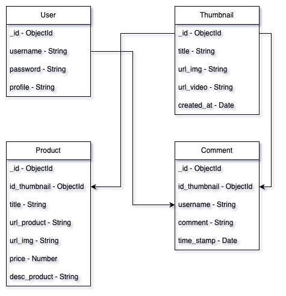

# Tokopedia Play Clone

This project is a cloning project of the backend of the [Tokopedia Play](https://www.tokopedia.com/play/channels) website. This project was created as part of the Final term assignment given by Generasi Gigih 3.0, a program of Yayasan Anak Bangsa Bisa.

**Created By** :

- Muhamad Putra Satria
- Fullstack Engineer
- GG3FSGP0442

**Deploy** :
- BE
    Base URL = https://finalterm-tokpedplay-be-production.up.railway.app/
- FE
    Netlify = https://finalterm-tokpedplay.netlify.app/

**Fitures Bonus** :
- [x] Add user profile picture and username on the top right corner of the page
- [ ] Use websocket or server side event for push real time data for comment list
- [x] Add feature search

## Table of Contents

- [Database Structure](#database-structure)
- [API Structure](#api-structure)
- [API Requests and Responses](#api-requests-and-responses)
- [How to Run Locally](#how-to-run-locally)

## Database Structure 

Here is an overview of the database structure based on the Tokopedia Play project.



## API Structure 

### Auth User
- Register User
    ```
    POST /register
    ```
- Login User
    ```
    POST /login
    ```
- Update Profile
    ```
    PUT /update-profile/{id_user}'
    ```
- Get Profile
    ```
    GET /get-profile/{id_user}
    ```
### Thumbnail

- Get All Thumbnails
  ```
  GET /thumbnail
  ```
- Details of a specific thumbnail
  ```
  GET /thumbnail/{id_thumb}
  ```
- Create a new thumbnail - (Private Route)
  ```
  POST /thumbnail
  ```
- Update an existing thumbnail - (Private Route)
  ```
  PUT /thumbnail/{id_thumb}
  ```
- Delete a thumbnail - (Private Route)
  ```
  DELETE /thumbnail/{id_thumb}
  ```
- Searh Thumbnail by Title
  ```
  GET /thumbnail/search?title={title}
  ```

### Product

- Get all products
  ```
  GET /product
  ```
- Details of a specific product
  ```
  GET /product/{id_product}
  ```
- Create a new product - (Private Route)
  ```
  POST /product/{id_thumb}
  ```
- Update an existing product - (Private Route)
  ```
  PUT /product/{id_product}
  ```
- Delete a product - (Private Route)
  ```
  DELETE /product/{id_product}
  ```
- Get Product by Thumbnail Id
  ```
  GET /product/thumbnail/{id_thumb}
  ```

### Comment

- Get all comments
  ```
  GET /comment
  ```
- Create a new comment - (Private Route)
  ```
  POST /comment
  ```
- Delete a comment - (Private Route)
  ```
  DELETE /comments/{id_comment}
  ```
- Get Comment by Thumbnail Id
  ```
  GET /comment/{id_thumb}
  ```

### Authentication

The private routes for creating, updating, and deleting resources require authentication. Make sure to include a valid JSON Web Token (JWT) in the Authorization header of your requests.

## API Requests and Responses

### Auth User

- **POST /register** 
    - URL Params
    ``None``
    - Headers
    ``Content-Type: application/json``
    - Body JSON
        ```
        {
            "username": <String>,
            "email": <String>,
            "password": <String>
        }
        ```
    - Success Response - 200
        ```
        {
            "message": "User Berhasil Terdaftar!",
            "result": {
                "_id": <ObjectId>,
                "username": <String>,
                "email": <String>,
                "password": <String>,
                "__v": 0
            }
        }
        ```
    - Error Response
        409
        ```
        { 
            "message": 'Email sudah ada, Masukkan email yang berbeda!'
        }
        ```
        500
        ```
        {
            "message": "Terjadi Kesalahan Server!"
        }
        ```
- **POST /login**
    - URL Params
    ``none``
    - Headers
    ``Content-Type: application/json``
    - Body JSON
        ```
        {
            "email": <String>,
            "password: <String>,
        }
        ```
    - Success Response - 200
        ```
        {
            "message": "Login Berhasil Yeyy!",
            "data": {
                "_id": <ObjectId>,
                "username": <String>
                "email": <String>,
                "password": <String>,
                "profile": <String>,
            },
            "tokenUser": <String>Token
        }
    - Error Response
        401
        ```
        {
            "message": 'Email Anda Salah!'
        }
        ```
        500
        ```
        { 
            "message": "Password Anda Salah!" 
        }
        ```
- **PUT /update-profile/{id_user}**
    - URL Params
    ``id_user``
    - Headers
    ``Content-Type: multipart/formdata``
    ``Authorization: Bearer <Token>``
    - Body JSON
        ```
        {
            "profile": <File>,
        }
        ```
    - Success Response - 201
        ```
        {
            "message": "Update data berhasil!",
            "data": {
                "profile": <String>/Base64,
            },
        }
    - Error Response
        500
        ```
        { 
            "message": "Password Anda Salah!" 
        }
        ```
- **GET /get-profile/{id_user}**
    - URL Params
    ``id_user``
    - Headers
    ``Content-Type: application/json``
    - Success Response - 200
        ```
        {
            "message": "Berhasil Mendapatkan Data!",
            "data": {
                "_id": <ObjectId>,
                "username: <String>,
                "email": <String>,
                "profile": <String>/Base64,
            },
        }
    - Error Response
        404
        ```
        {
            "message": "Terjadi Kesalahan Server!"
        }
        ```
        500
        ```
        { 
            "message": "Password Anda Salah!" 
        }
        ```

### Thumbnail
- **GET /thumbnail** 
    - URL Params
    ``None``
    - Headers
    ``Content-Type: application/json``
    - Success Response - 201
        ```
        {
            "message": "Berhasil Mendapatkan Data!",
            "data": [
                {
                    "_id": <ObjectId>,
                    "title": <String>,
                    "url_video": <String>,
                    "url_img": <String>,
                    "created_at: <Date>
                    "__v": 0
                },
            ]
        }
        ```
    - Error Response
        404
        ```
        { 
            "message": "Tidak Terdapat Data!", 
            "data": []
        }
        ```
        500
        ```
        {
            message: "Terjadi Kesalahan Server!"
        }
        ```
- **GET /thumbnail/{id_thumb}** 
    - URL Params
    ``id_thumb``
    - Headers
    ``Content-Type: application/json``
    - Success Response - 201
        ```
        {
            "message": "Berhasil Mendapatkan Data!",
            "data": {
                "_id": <ObjectId>,
                "title": <String>,
                "url_video": <String>,
                "url_img": <String>,
                "created_at": <Date>,
                "__v": 0
            }
        }
        ```
    - Error Response
        404
        ```
        { 
            "message": `Data tidak ditemukan dengan ID {id_thumb}` 
        }
        ```
        500
        ```
        {
            "message": "Terjadi Kesalahan Server!"
        }
        ```
- **POST /thumbnail** 
    - URL Params
    ``none``
    - Headers
    ``Content-Type: application/json``
    ``Authorization: Bearer <Token>``
    - Body JSON
        ```
        {
            "title": <String>,
            "url_img": <String>,
            "url_video": <String>,
        }
        ```
    - Success Response - 201
        ```
        {
            "message": "Berhasil Menambahkan Thumbnail!",
            "data": {
                "title": <String>,
                "url_img": <String>,
                "url_video": <String>,
                "created_at": <Date>,
                "_id": <String>,
                "__v": 0
            }
        }
        ```
    - Error Response
        500
        ```
        {
            "message": "Terjadi Kesalahan Server!"
        }
        ```
- **PUT /thumbnail/{id_thumb}** 
    - URL Params
    ``id_thumb``
    - Headers
    ``Content-Type: application/json``
    ``Authorization: Bearer <Token>``
    - Body JSON
        ```
        {
            "title": <String>,
            "url_img": <String>,
            "url_video": <String>,
        }
        ```
    - Success Response - 201
        ```
        {
            "message": "Berhasil Merubah Data!",
            "data": {
                "_id": <ObjectId>,
                "title": <String>,
                "url_img": <String>,
                "url_video": <String>,
                "created_at": <Date>,
                "__v": 0
            }
        }
        ```
    - Error Response
        404
        ```
        { 
            "message": `Data tidak ditemukan dengan ID {id_thumb}` 
        }
        ```
        500
        ```
        {
            "message": "Terjadi Kesalahan Server!"
        }
        ```
- **DELETE /thumbnail/{id_thumb}** 
    - URL Params
    ``id_thumb``
    - Headers
    ``Content-Type: application/json``
    ``Authorization: Bearer <Token>``
    - Success Response - 201
        ```
        {
            "message": "Berhasil menghapus Data dengan ID {id_thumb}",
            "deletedData": {
                "_id": <ObjectId>,
                "title": <String>,
                "url_video": <String>,
                "url_img": <String>,
                "created_at": <Date>,
                "__v": 0
            }
        }
        ```
    - Error Response
        404
        ```
        { 
            "message": `Data tidak ditemukan dengan ID {id_thumb}` 
        }
        ```
        500
        ```
        {
            "message": "Terjadi Kesalahan Server!"
        }
        ```
- **GET /thumbnail/search?title={makan}** 
    - URL Query
    ``title``
    - Headers
    ``Content-Type: application/json``
    - Success Response - 201
        ```
        {
            "message": "Berhasil Mendapatkan Data!",
            "data": [
                {
                    "_id": <ObjectId>,
                    "title": <String>,
                    "url_video": <String>,
                    "url_img": <String>,
                    "created_at": <Date>,
                    "__v": 0
                }
            },
        ]
        ```
    - Error Response
        404
        ```
        { 
            "message": "Tidak ditemukan thumbnail dengan judul yang sesuai!" 
        }
        ```
        500
        ```
        {
            "message": "Terjadi Kesalahan Server!"
        }
        ```

### Product
- **GET /product** 
    - URL Params
    ``None``
    - Headers
    ``Content-Type: application/json``
    - Success Response - 201
        ```
        {
            "message": "Berhasil Mendapatkan Data!",
            "data": [
                {
                    "_id": <ObjectId>,
                    "id_thumbnail": <String>,
                    "title": <String>,
                    "url_product": <String>,
                    "url_img": <String>,
                    "price": <Number>,
                    "desc_product": <String>,
                    "__v": 0
                }
            ]
        }
        ```
    - Error Response
        404
        ```
        { 
            "message": "Tidak Terdapat Data!", 
            "data": []
        }
        ```
        500
        ```
        {
            "message": "Terjadi Kesalahan Server!"
        }
        ```
- **GET /product/{id_product}** 
    - URL Params
    ``id_product``
    - Headers
    ``Content-Type: application/json``
    - Success Response - 201
        ```
        {
            "message": "Berhasil Mendapatkan Data!",
            "data": {
                "_id": <ObjectId>,
                "id_thumbnail": <String>,
                "title": <String>,
                "url_product": <String>,
                "url_img": <String>,
                "price": <Number>,
                "desc_product": <String>,
                "__v": 0
            }
        }
        ```
    - Error Response
        404
        ```
        { 
            "message": `Data tidak ditemukan dengan ID {id_thumb}` 
        }
        ```
        500
        ```
        {
            "message": "Terjadi Kesalahan Server!"
        }
        ```
- **POST /product/{id_thumb}** 
    - URL Params
    ``id_thumb``
    - Headers
    ``Content-Type: application/json``
    ``Authorization: Bearer <Token>``
    - Body JSON
        ```
        {
            "title": <String>,
            "url_product": <String>,
            "url_img": <String>,
            "price": <Number>,
            "desc_product": <String>,
        }
        ```
    - Success Response - 201
        ```
        {
            "message": "Berhasil Menambahkan Product!",
            "data": {
                "_id": <ObjectId>,
                "id_thumbnail": <String>,
                "title": <String>,
                "url_product": <String>,
                "url_img": <String>,
                "price": <Number>,
                "desc_product": <String>,
                "__v": 0
            }
        }
        ```
    - Error Response
        500
        ```
        {
            "message": "Terjadi Kesalahan Server!"
        }
        ```
- **PUT /product/{id_product}** 
    - URL Params
    ``id_product``
    - Headers
    ``Content-Type: application/json``
    ``Authorization: Bearer <Token>``
    - Body JSON
        ```
        {
            "title": <String>,
            "url_product": <String>,
            "url_img": <String>,
            "price": <Number>,
            "desc_product": <String>,
        }
        ```
    - Success Response - 201
        ```
        {
            "message": "Berhasil Merubah Data!",
            "data": {
                "_id": <ObjectId>,
                "id_thumbnail": <String>,
                "title": <String>,
                "url_product": <String>,
                "url_img": <String>,
                "price": <Number>,
                "desc_product": <String>,
                "__v": 0
            }
        }
        ```
    - Error Response
        404
        ```
        { 
            "message": `Data tidak ditemukan dengan ID {id_product}` 
        }
        ```
        500
        ```
        {
            "message": "Terjadi Kesalahan Server!"
        }
        ```
- **DELETE /product/{id_product}**
    - URL Params
    ``id_thumb``
    - Headers
    ``Content-Type: application/json``
    ``Authorization: Bearer <Token>``
    - Success Response - 201
        ```
        {
            "message": "Berhasil menghapus Data dengan ID {id_product}",
            "deletedData": {
                "_id": <ObjectId>,
                "id_thumbnail": <String>,
                "title": <String>,
                "url_product": <String>,
                "url_img": <String>,
                "price": <Number>,
                "desc_product": <String>,
                "__v": 0
            }
        }
        ```
    - Error Response
        404
        ```
        { 
            "message": `Data tidak ditemukan dengan ID {id_product}` 
        }
        ```
        500
        ```
        {
            "message": "Terjadi Kesalahan Server!"
        }
        ```
- **GET /product/thumbnail/{id_thumb}**
    - URL Params
    ``id_thumb``
    - Headers
    ``Content-Type: application/json``
    - Success Response - 201
        ```
        {
            "message": "Berhasil Mendapatkan Data!",
            "data": [
                {
                    "_id": <ObjectId>,
                    "id_thumbnail": <String>,
                    "title": <String>,
                    "url_product": <String>,
                    "url_img": <String>,
                    "price": <Number>,
                    "desc_product": <String>,
                    "__v": 0
                }
            ]
        }
        ```
    - Error Response
        404
        ```
        { 
            "message": "Tidak Terdapat Product!",
            "data" : []
        }
        ```
        500
        ```
        {
            "message": "Terjadi Kesalahan Server!"
        }
        ```

### Comment
- **GET /comment** 
    - URL Params
    ``None``
    - Headers
    ``Content-Type: application/json``
    - Success Response - 201
        ```
        {
            "message": "Berhasil Mendapatkan Data!",
            "data": [
                {
                    "_id": <ObjectId>,
                    "id_thumbnail": <ObjectId>,
                    "username": <String>,
                    "comment": <String>,
                    "time_stamp": <Date>,
                    "__v": 0
                }
            ]
        }
        ```
    - Error Response
        404
        ```
        { 
            "message": "Tidak Terdapat Data!", 
            "data": []
        }
        ```
        500
        ```
        {
            message: "Terjadi Kesalahan Server!"
        }
        ```
- **POST /comment/{id_thumb}**
    - URL Params
    ``id_thumb``
    - Headers
    ``Content-Type: application/json``
    ``Authorization: Bearer <Token>``
    - Body JSON
        ```
        {
            "comment": <String>,
        }
        ```
    - Success Response - 201
        ```
        {
            "message": "Berhasil Menambahkan Comment!",
            "data": {
                "_id": <ObjectId>,
                "id_thumbnail": <ObjectId>,
                "username": <String>,
                "comment": <String>,
                "time_stamp": <Date>,
                "__v": 0
            }
        }
        ```
    - Error Response
        404
        ```
        {
            "message": "Isi Komen Dengan Benar!"
        }
        ```
        500
        ```
        {
            "message": "Terjadi Kesalahan Server!"
        }
        ```
- **DELETE /comment/{id_comment}**
    - URL Params
    ``id_comment``
    - Headers
    ``Content-Type: application/json``
    ``Authorization: Bearer <Token>``
    - Success Response - 201
        ```
        {
            "message": "Berhasil menghapus Data dengan ID {id_comment}",
            "deletedData": {
                "_id": <ObjectId>,
                "id_thumbnail": <ObjectId>,
                "username": <String>,
                "comment": <String>,
                "time_stamp": <Date>,
                "__v": 0
            }
        }
        ```
    - Error Response
        404
        ```
        { 
            "message": `Data tidak ditemukan dengan ID {id_comment}` 
        }
        ```
        500
        ```
        {
            "message": "Terjadi Kesalahan Server!"
        }
        ```
- **GET /comment/{id_thumb}**
    - URL Params
    ``id_thumb``
    - Headers
    ``Content-Type: application/json``
    - Success Response - 201
        ```
        {
            "message": "Berhasil Mendapatkan Data!",
            "data": [
                {
                    "_id": <ObjectId>,
                    "id_thumbnail": <ObjectId>,
                    "username": <String>,
                    "comment": <String>,
                    "time_stamp": <Date>,
                    "__v": 0
                }
            ]
        }
        ```
    - Error Response
        404
        ```
        { 
            "message": "Tidak Terdapat Data!",
            "data" : []
        }
        ```
        500
        ```
        {
            "message": "Terjadi Kesalahan Server!"
        }
        ```

## How to run locally
**Prerequisites**
- Download Node.js from the official website: [Node](https://nodejs.org/)
- Download VSCode from the official website: [VSCode](https://code.visualstudio.com/)
- Download Mongodb Compass or Mongodb Shell: [Compass](https://www.mongodb.com/try/download/compass) [Shell](https://www.mongodb.com/try/download/shell)

**Steps**
***BACKEND***
- Clone this repo
    ```
    git clone https://github.com/mpsalunggg/FinalTerm-TokpedPlay-BE.git
    ```
- Change into the project directory
    ```
    cd FinalTerm-TokpedPlay-BE
    ```
- Install project dependencies using npm
    ```
    npm install
    ```
- Configure MongoDB with mongoshell
    - Make sure MongoDB is installed and running on your system.
        ```
        mongosh --host localhost --port <port>
        ```
    - Create a new database and note down its connection URL (Mongodb Compass).
- Set up environment variables
    - Create a new file named .env in the root directory of the project.
    - Add the following environment variables to the .env file:
        ```
        DB_MONGO=<your_mongodb_url>
        PORT=<your_running_port>
        SECRET_KEY=<your_secretkey>
        ```
- Run the application
    ```
    npm run start
    ```
- And the last
    ```
    Server Listening On Port <port>
    Database Connected
    ```
Here are the steps to run the frontend of the project after running the server:
***FRONTEND***
- Clone this repo
    ```
    git clone https://github.com/mpsalunggg/FinalTerm-TokpedPlay-FE.git
    ```
- Change into the project directory
    ```
    cd FinalTerm-TokpedPlay-FE
    ```
- Install project dependencies using npm
    ```
    npm install
    ```
- Configure the Endpoint
    - Open the utils folder.
    - In the endpoint.js file, locate the BASE_URL variable.
    - Comment out the existing variable and modify the configuration as per your choice:
        ```
        const BASE_URL = "http://localhost:<your_running_server_port>/"
        // const BASE_URL = "https://finalterm-tokpedplay-be-production.up.railway.app/"
        ```

- Run the application
    ```
    npm run dev
    ```


*Im Sorry for any shortcomings, enjoy the app😁🙏*
